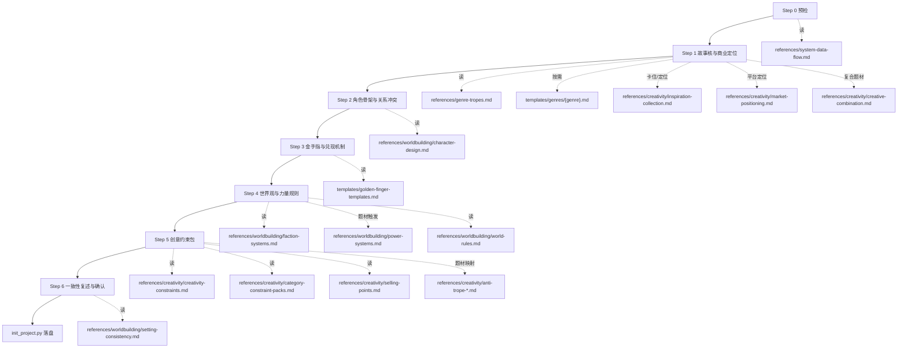

# `webnovel-init` 上游拓扑审计与 Codex 对照

**日期**：2026-03-06  
**目的**：把 Claude Code 侧 `webnovel-init` 的真实来源、阶段顺序、引用文件、交互类型梳理清楚，并逐项对照当前 Codex 适配实现。

## 结论先看

当前 Codex 版最大偏差不是“有没有跑通”，而是 **把本该“候选引导 + 手动输入”的阶段，过度简化成了纯填空**。

上游 `webnovel-init` 的真源分两层：

1. `webnovel-writer/skills/webnovel-init/SKILL.md`
   - 决定 **Step 0 ~ Step 6 的阶段顺序、必收字段、触发加载规则、最终确认结构**
2. `webnovel-writer/scripts/init_project.py`
   - 决定 **最终生成参数与落盘文件**

所以 Codex 版要对齐的不是“让 init 能运行”，而是：

- **交互阶段** 对齐 `SKILL.md`
- **候选项/提示语来源** 对齐 `references/` 与 `templates/`
- **最终生成** 对齐 `init_project.py`

## 上游拓扑图

## 逐阶段真源与应有交互

### Step 0：预检与上下文加载

**真源**
- `webnovel-writer/skills/webnovel-init/SKILL.md`
- `webnovel-writer/skills/webnovel-init/references/system-data-flow.md`
- `webnovel-writer/scripts/webnovel.py`

**职责**
- 确认当前目录可写
- 确认插件脚本目录与 `webnovel.py` 入口
- 先跑 `where`，避免写错项目目录

**交互类型**
- 非创作输入
- 以“状态显示/预检结果”形式呈现

### Step 1：故事核与商业定位

**真源**
- `webnovel-writer/skills/webnovel-init/SKILL.md`
- `webnovel-writer/skills/webnovel-init/references/genre-tropes.md`
- `webnovel-writer/templates/genres/{genre}.md`
- `webnovel-writer/skills/webnovel-init/references/creativity/inspiration-collection.md`
- `webnovel-writer/skills/webnovel-init/references/creativity/market-positioning.md`
- `webnovel-writer/skills/webnovel-init/references/creativity/creative-combination.md`

**上游字段**
- 书名
- 题材（支持 A+B）
- 目标规模
- 一句话故事
- 核心冲突
- 目标读者/平台

**应有交互类型**
- 书名：自由输入
- 题材：固定菜单
- 第二题材：固定菜单
- 目标规模：常用预设 + 手动输入
- 一句话故事：**候选方向 + 手动输入**
- 核心冲突：**候选方向 + 手动输入**
- 目标读者：固定菜单
- 平台：固定菜单

**说明**
- `SKILL.md` 明写：`优先让用户自由描述，再二次结构化确认；若用户卡住，给 2-4 个候选方向供选。`
- 这意味着这一步不是“全固定菜单”，而是 **菜单与提示并存**
- 候选来源不该凭空写死，应优先来自：
  - `templates/genres/{genre}.md` 中的核心流派、核心冲突、卷级冲突示例
  - `market-positioning.md` 中的平台/读者画像
  - `inspiration-collection.md` 中的灵感兜底模版

### Step 2：角色骨架与关系冲突

**真源**
- `webnovel-writer/skills/webnovel-init/SKILL.md`
- `webnovel-writer/skills/webnovel-init/references/worldbuilding/character-design.md`

**上游字段**
- 主角姓名
- 主角欲望
- 主角缺陷
- 主角结构
- 感情线配置
- 反派分层与镜像对抗一句话
- 可选：主角原型标签 / 多主角分工

**应有交互类型**
- 主角姓名：自由输入，允许给示例名但不强制
- 主角欲望：**候选方向 + 手动输入**
- 主角缺陷：**候选方向 + 手动输入**
- 主角结构：固定菜单
- 感情线配置：固定菜单
- 主角原型标签：固定菜单或候选选择
- 反派镜像：**候选方向 + 手动输入**

**说明**
- `character-design.md` 已给出主角欲望/缺陷示例、经典主角原型、反派等级与镜像原则
- 这些应转化成引导，而不是裸填空

### Step 3：金手指与兑现机制

**真源**
- `webnovel-writer/skills/webnovel-init/SKILL.md`
- `webnovel-writer/templates/golden-finger-templates.md`

**上游字段**
- 金手指类型
- 名称/系统名
- 风格
- 可见度
- 不可逆代价
- 成长节奏
- 条件项：系统性格 / 重生时间点 / 器灵边界等

**应有交互类型**
- 金手指类型：固定菜单
- 名称：自由输入
- 风格：固定菜单
- 可见度：固定菜单
- 不可逆代价：**候选方向 + 手动输入**
- 成长节奏：固定菜单
- 条件项：按类型触发的补充提问

### Step 4：世界观与力量规则

**真源**
- `webnovel-writer/skills/webnovel-init/SKILL.md`
- `webnovel-writer/skills/webnovel-init/references/worldbuilding/faction-systems.md`
- `webnovel-writer/skills/webnovel-init/references/worldbuilding/power-systems.md`
- `webnovel-writer/skills/webnovel-init/references/worldbuilding/world-rules.md`

**上游字段**
- 世界规模
- 力量体系类型
- 势力格局
- 社会阶层与资源分配
- 题材相关：货币体系 / 宗门层级 / 境界链

**应有交互类型**
- 世界规模：固定菜单
- 力量体系类型：**候选方向 + 手动输入**
- 势力格局：**模板候选 + 手动输入**
- 社会阶层与资源分配：**模板候选 + 手动输入**
- 题材相关补充项：按题材触发

### Step 5：创意约束包（差异化核心）

**真源**
- `webnovel-writer/skills/webnovel-init/SKILL.md`
- `webnovel-writer/skills/webnovel-init/references/creativity/creativity-constraints.md`
- `webnovel-writer/skills/webnovel-init/references/creativity/category-constraint-packs.md`
- `webnovel-writer/skills/webnovel-init/references/creativity/selling-points.md`
- `webnovel-writer/skills/webnovel-init/references/creativity/anti-trope-*.md`

**上游要求**
- 按题材生成 2-3 套创意包
- 每套带：一句话卖点 / 反套路 / 硬约束 / 主角缺陷驱动 / 反派镜像 / 开篇钩子
- 三问筛选
- 五维评分
- 用户最终选择或拒绝

**应有交互类型**
- 先展示方案详情，再让用户选
- 不应只显示压缩成一行的 `id｜title｜one_liner`

### Step 6：一致性复述与最终确认

**真源**
- `webnovel-writer/skills/webnovel-init/SKILL.md`
- `webnovel-writer/skills/webnovel-init/references/worldbuilding/setting-consistency.md`

**上游要求**
- 输出初始化摘要草案
- 必须用户明确确认
- 用户若改局部，应回对应 Step 最小重采集

**应有交互类型**
- 摘要展示
- 最终确认
- 最好支持“回到某一步修改”

## 当前 Codex 版与上游差异

| 项目 | 上游要求 | 当前 Codex 版 | 结论 |
|---|---|---|---|
| 题材分类 | 固定菜单 | 已有 | 基本对齐 |
| 第二题材 | 固定菜单 | 已有，但长菜单重绘不稳定 | 需修 |
| 目标规模 | 预设/引导 + 输入 | 纯文本 | 不足 |
| 一句话故事 | 候选 + 手动输入 | 纯文本 | 明显缺口 |
| 核心冲突 | 候选 + 手动输入 | 纯文本 | 明显缺口 |
| 目标读者/平台 | 结构化定位 | 合并成单个文本框 | 明显缺口 |
| 主角欲望 | 候选 + 手动输入 | 纯文本 | 明显缺口 |
| 主角缺陷 | 候选 + 手动输入 | 纯文本 | 明显缺口 |
| 主角原型 | 可选候选 | 未进入交互 | 缺口 |
| 反派镜像 | 候选 + 手动输入 | 纯文本 | 明显缺口 |
| 金手指类型/风格/可见度 | 固定菜单 | 已有 | 基本对齐 |
| 不可逆代价 | 候选 + 手动输入 | 纯文本 | 不足 |
| 世界规模 | 固定菜单 | 已有 | 基本对齐 |
| 力量体系类型 | 候选 + 手动输入 | 纯文本 | 明显缺口 |
| 势力格局 | 模板候选 + 输入 | 纯文本 | 明显缺口 |
| 社会阶层与资源分配 | 模板候选 + 输入 | 纯文本 | 明显缺口 |
| 创意约束包展示 | 详情 + 评分 + 选择 | 一行压缩选项 | 信息量不足 |
| 最终确认后回改 | 最小重采集 | 仅确认/取消 | 不足 |

## 当前长菜单打印问题的根因判断

这个问题不是“第二题材这一个菜单写坏了”，而是当前箭头菜单渲染策略本身不稳。

当前实现是：

- 在当前光标位置直接打印整块菜单
- 用 ANSI `上移 + 清行` 试图把旧菜单擦掉

这在以下场景会失效：

1. 菜单高度超过当前光标下方剩余空间，终端发生 **scroll**
2. 终端窗口较小，部分行发生 **自动换行**
3. 菜单项较多，清理的是“逻辑行数”，不是“实际占用屏幕行数”

所以它不是单字段 bug，而是 **菜单层渲染模型不对**。

## Codex 版下一步修正原则

1. **先对齐真源，再修 UI**
   - 不能凭感觉补问题
2. **能从 source 读，就不手写平行逻辑**
   - 候选项与提示优先从 `SKILL.md` / `references/` / `templates/` 解析
3. **开放字段改成“候选 + 手动输入”**
   - 这才贴近上游 Claude 交互
4. **长菜单改成稳定渲染层**
   - 不能再靠当前位置裸打印
   - 至少要切到稳定屏幕区域；更稳妥的是全屏/半屏式菜单视图

## 本审计对应的直接开发任务

1. 扩展 `init_source_loader.py`
   - 读取题材模板、人物设计、市场定位、世界观参考里的候选项
2. 扩展 `init_terminal_ui.py`
   - 为开放字段增加“候选优先，允许手填”的交互
3. 重写箭头菜单渲染层
   - 解决长菜单反复打印
4. 更新测试
   - 覆盖候选提取与菜单渲染

